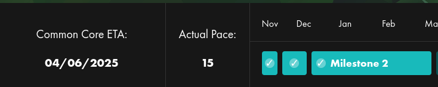

# PacedExtension

A simple extension for the 42 intra V3 to know your current pace.



# Installation Guide

For Firefox, click [here](https://addons.mozilla.org/fr/firefox/addon/paced-extension/).
For Chrome, click [here](https://chrome.google.com/webstore/detail/phoenix-dashboard/enlndddhnnpolihocgggjmneofjhaiag).
Or you can download directly in the [Release](https://github.com/TheoZerbibi/PacedExtension/releases) page.

Ensure that your intra V3 is enabled (you can enable it in your [profile settings](https://profile.intra.42.fr/v3_early_access)).

## Locally
Download the extension with the following command:

```bash
git clone https://github.com/TheoZerbibi/PacedExtension.git
```

### Chromium
Open the Extension Management page by navigating to `chrome://extensions` and enabling Developer Mode. Then, click on the "Load Unpacked" button and select the extension directory.

### Firefox
Open the Extension Management page by navigating to `about:debugging#/runtime/this-firefox`.
Then, click on the "Load a temporary add-on" button and select the `manifest-firefox.json` in repository folder.

## Contributors

<a href="https://github.com/TheoZerbibi/PacedExtension/graphs/contributors">
	
</a>